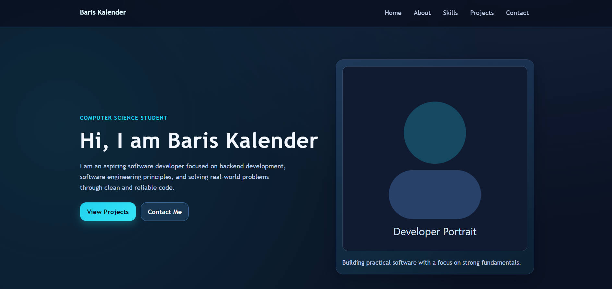
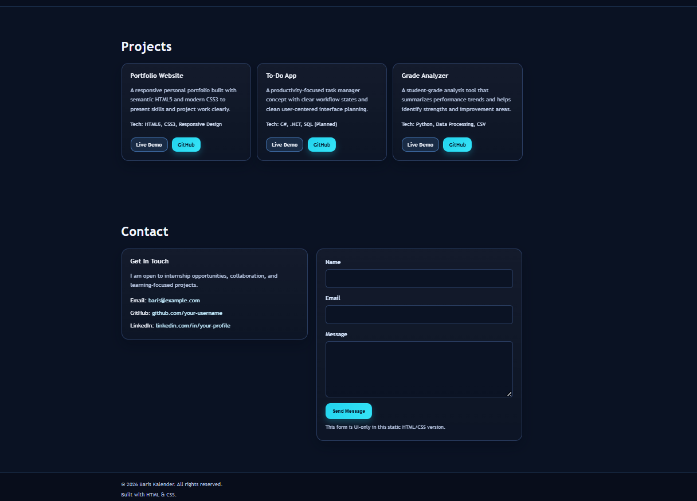

# Baris Kalender | Personal Portfolio

A beginner-friendly but polished single-page personal portfolio website built with only HTML5 and CSS3. This project is designed for a computer science student or aspiring software developer and is ready to publish as a GitHub portfolio project.

## Features

- Semantic, accessible HTML5 structure
- Modern CSS3 design with Flexbox and Grid
- Professional dark-blue theme with clean visual hierarchy
- Fully responsive layout for mobile, tablet, and desktop
- Sticky navigation with smooth anchor flow
- Skills, projects, and contact sections tailored for student portfolios
- Reusable CSS variables for colors, spacing, and common values
- Visible focus states and labeled form fields for accessibility

## Technologies Used

- HTML5
- CSS3
- Flexbox
- CSS Grid
- CSS Custom Properties (variables)

## Project Structure

    portfolio-website/
    |-- index.html
    |-- style.css
    |-- README.md

## How to Run Locally

1. Clone or download this repository.
2. Open the project folder.
3. Open index.html in your browser.

Example:

    git clone https://github.com/your-username/portfolio-website.git
    cd portfolio-website
    start index.html

You can also use VS Code Live Server if you prefer a local development server.

## Screenshot Placeholder

Add screenshots after you customize the content:

- Desktop view screenshot
- Mobile view screenshot

Suggested location:

    assets/screenshots/

And then reference them here:

    
    

## Future Improvements

- Replace placeholders with real profile photo and real project links
- Add downloadable resume link
- Add project detail pages
- Connect contact form to a backend service (for example Formspree or a custom API)
- Add light/dark theme toggle in a future JavaScript version

## License

This project is open source and available under the MIT License.

You can create a LICENSE file with the MIT text if you want to publish it publicly.
